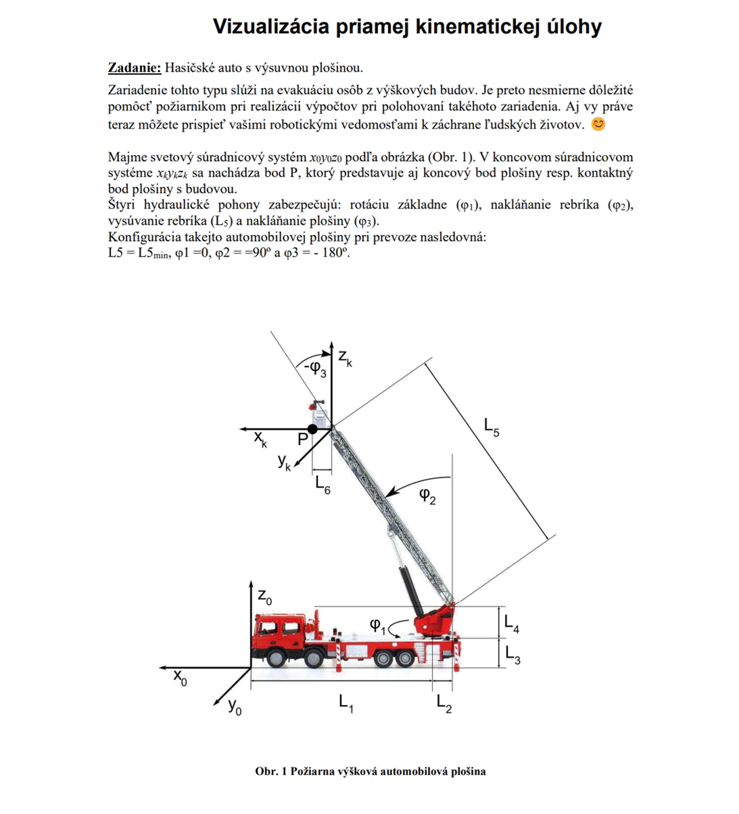
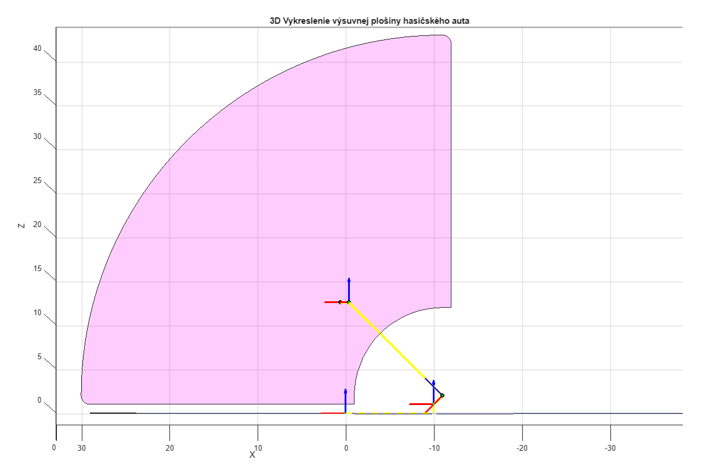
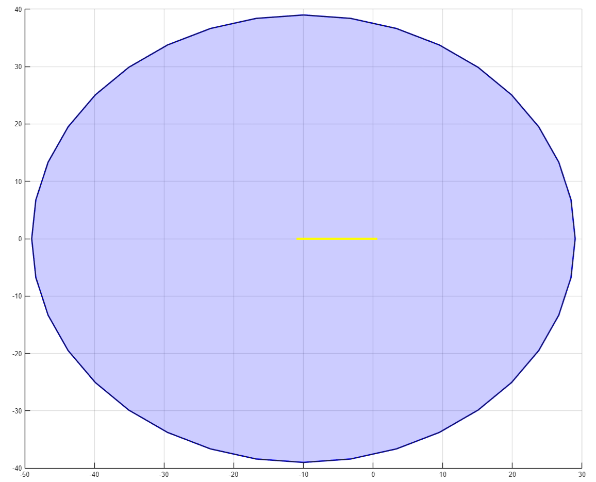
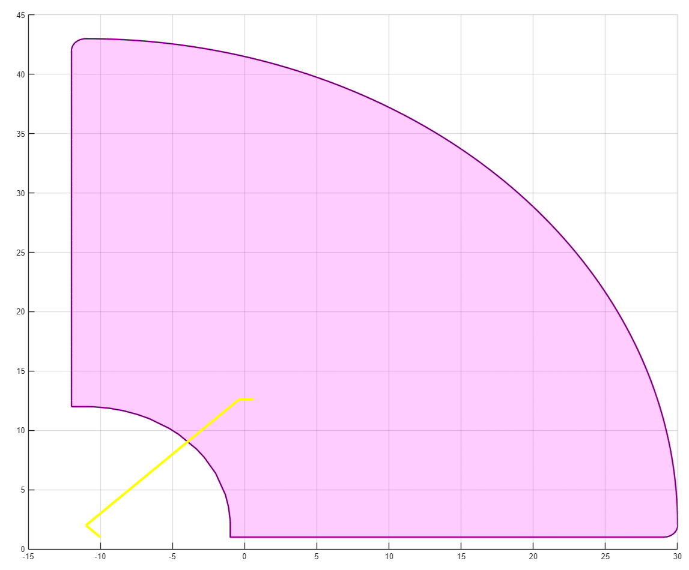
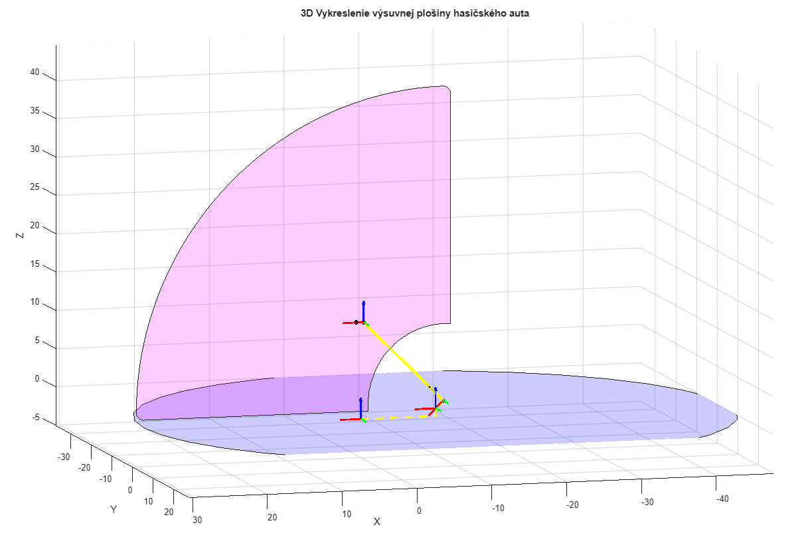
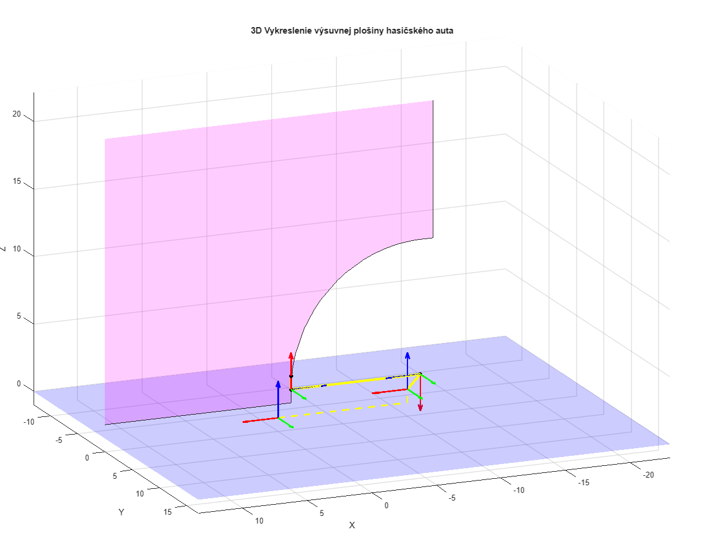

> Zadanie č. 1 Matúš Ondrejka
>
> Slovenská Technická Univerzita – Fakulta elektrotechniky a informatiky
> Ilkovičova 3, 812 19 Bratislava
>
> **Vizualizácia** **priamej** **kinematickej** **úlohy** Robotika

**Ak.** **Rok:** 2024/2025 **Autor:** Matúš Ondrejka **Ročník**
**štúdia:** 2.Bc

Zadanie č. 1 Matúš
Ondrejka

> 2

Zadanie č. 1 Matúš Ondrejka

**Rozbor** **úlohy**

Úloha sa zaoberá **priamou** **kinematickou** **úlohou** hasičského auta
s výsuvnou plošinou. Cieľom je:

> 1\. Odvodiť **transformačnú** **maticu** medzi svetovým a koncovým
> súradnicovým systémom.
>
> 2\. Vypočítať **polohu** **koncového** **bodu** **P** (miesta, kde
> plošina dotýka budovu).
>
> 3\. Vizualizovať mechanizmus a **pracovný** **priestor** v dvoch
> rovinách (X₀Z₀ a X₀Y₀).

Najdôležitejšie je si uvedomiť, že výsuvná plošina hasičského auta má 4
pohyblivé časti:

> • **Rotácia** **základne** (uhol φ₁)
>
> •     **Nakláňanie** **rebríka** (uhol φ₂) •     **Vysúvanie**
> **rebríka** (dĺžka L₅) •     **Nakláňanie** **plošiny** (uhol φ₃)

Každý pohyb sa dá popísať rotačnou alebo translačnou maticou. Vďaka
vynásobeniu všetkých matíc v poradí od základneažpo koniecvieme
zistiťvýslednú maticu **T0k**. Trebaale podotknúť, že nie len pohyblivé
časti spadajú do výslednej matice **T0k**. Keďže náš súradnicový systém
x0, y0, z0 začína pri prednom nárazníku hasičského auta, treba do
výslednej matice zarátať dĺžku začiatku vozidla po stred základne, ktorá
rotuje. Taktiež je potrebné si uvedomiť, že základňa, ktorá rotuje nie
je priamo na zemi a tento pohyb treba taktiež brať do **T0k** spolu s
tým, že bod kde je zabezpečené nakláňanie rebríka je vo výške L4 s
posunom L2 od základne, ktorá rotuje. Pri správnom určení naša výsledná
matica bude **T0k** vyzerať:

> 𝑻𝟎𝑲 = 𝑻𝟎𝟖 = 𝑇(−𝐿1) ∗ 𝑇(𝐿3) ∗ 𝑅𝑧(𝜑1) ∗ 𝑇(−𝐿2) ∗ 𝑇(𝐿4) ∗ 𝑅𝑦(𝜑2) ∗ 𝑇(𝐿5)
> ∗ 𝑅𝑦(𝜑3)

A náš výsledný vektor pre bod 𝑃 bude:

> 𝐿6 ⃗⃗⃗⃗ = ( 0 )
>
> 1

Pomocou výslednej matice a aj výsledného vektora, vieme zapísať vzťah
pre 𝑃 :

> ⃗⃗⃗⃗⃗ = 𝑇 8 ∗ ⃗⃗⃗⃗
>
> 𝐿6
>
> 𝑷𝟎 = 𝑇(−𝐿1) ∗ 𝑇(𝐿3) ∗ 𝑅𝑧(𝜑1) ∗ 𝑇(−𝐿2) ∗ 𝑇(𝐿4) ∗ 𝑅𝑦(𝜑2) ∗ 𝑇(𝐿5) ∗
> 𝑅𝑦(𝜑3) ∗ ( 0 ) 1

Pre uľahčenie výpočtov si vieme vyššie uvedený vzťah rozdeliť pomocou
substitúcie na: 𝑨 = 𝑇(−𝐿1) ∗ 𝑇(𝐿3) ∗ 𝑅𝑧(𝜑1)

> 𝑩 = 𝑇(−𝐿2) ∗ 𝑇(𝐿4) ∗ 𝑅𝑦(𝜑2)
>
> 𝑪 = 𝑇(𝐿5) ∗ 𝑅𝑦(𝜑3)
>
> 3

Zadanie č. 1 Matúš Ondrejka

> 1 0 0 − 𝐿1 1 0 0 0 1 0 0 0 1 0 0 0 1 0 0 0 1
>
> 0 0 0 1 0 0 0
>
> 0 cos(𝜑1) − sin(𝜑1) 0

0 sin(𝜑1) cos(𝜑1) 0 𝐿3 0 0 1

> 1 0 0 0

0 0)\]

> 1
>
> cos(𝜑1) − sin(𝜑1) 0 − 𝐿1
>
> 𝑨 = (sin(𝜑1)
>
> 0

cos(𝜑1) 0 0 0 1 𝐿3 0 0 1

> 1 0 0 − 𝐿2 1 0 0 0 1 0 0 0 1 0 0 0 1 0 0 0 1
>
> 0 0 0 1 0 0 0
>
> 0 cos(𝜑2) 0

𝐿4) ∗ (sin(𝜑2) 0 1 0 0

− 𝑠𝑖𝑛(𝜑2) 0

> cos(𝜑2) 0

0 0)\]

1

> cos(𝜑2) 0
>
> 𝑩 = ( sin(𝜑2) 0 0 0

− 𝑠𝑖𝑛(𝜑2) − 𝐿2 0 0

> cos(𝜑2) 𝐿4 0 1
>
> 1 0 0 𝑪 = \[(0 1 0
>
> 0 0 0
>
> 0 cos(𝜑3) 0

𝐿5) ∗ (sin(𝜑3) 0 1 0 0

− 𝑠𝑖𝑛(𝜑3) 0

> cos(𝜑3) 0

0 0)\]

1

> cos(𝜑3) 0 − 𝑠𝑖𝑛(𝜑3) 0 0 1 0 0 sin(𝜑3) 0 cos (𝜑3) 𝐿5
>
> 0 0 0 1

Tieto 3 substitúcie môžeme následne vyjadriť ako jednu veľkú maticu T08:

> 𝑻𝟎𝟖 = 𝐴 ∗ 𝐵 ∗ 𝐶
>
> cos(𝜑1) − sin(𝜑1) 0
>
> sin(𝜑 ) cos(𝜑 ) 0 𝟎𝟖 0 0 1
>
> 0 0 0

− 𝐿1 cos(𝜑2) 0 − 𝑠𝑖𝑛(𝜑2) 0 0 1 0

> 𝐿3 sin(𝜑2) 0 cos(𝜑2) 1 0 0 0

− 𝐿2 cos(𝜑3) 0 − 𝑠𝑖𝑛(𝜑3) 0 0 0 1 0 0

> 𝐿4 sin(𝜑3) 0 cos(𝜑3) 𝐿5 1 0 0 0 1
>
> cos(𝜑1)cos(𝜑2 − 𝜑3) −sin(𝜑1) cos(𝜑1)sin(𝜑2 − 𝜑3) −𝐿1 + cos(𝜑1) ∗ \[𝐿5
> sin(𝜑2) − 𝐿2\]
>
> sin(𝜑 )cos(𝜑 − 𝜑 ) 𝟎𝟖
>
> sin(𝜑3 − 𝜑2)
>
> ( 0

cos(𝜑1) 0

> 0

sin(𝜑1)sin(𝜑2 − 𝜑3)

> cos(𝜑2 − 𝜑3) 0

sin(𝜑1) ∗ \[𝐿5 sin(𝜑2) − 𝐿2\]

> 𝐿3 + 𝐿4 + 𝐿5 cos(𝜑2)
>
> 1 )
>
> 4

Zadanie č. 1 Matúš Ondrejka

Takže po vyjadrení vzťah bude vyzerať:

> 𝐿6 𝑷𝟎 = 𝑇 8 ∗ ( 0 )
>
> 1
>
> 𝐿6 ∗ cos(𝜑1)cos(𝜑2 − 𝜑3) − 𝐿1 + cos(𝜑1) ∗ \[𝐿5 sin(𝜑2) − 𝐿2\]
>
> ⃗⃗⃗⃗⃗ = (

𝐿6 ∗ sin(𝜑1)cos(𝜑2 − 𝜑3) + sin(𝜑1) ∗ \[𝐿5 sin(𝜑2) − 𝐿2\] ) 𝐿6 ∗ sin(𝜑3 −
𝜑2) + 𝐿3 + 𝐿4 + 𝐿5 cos(𝜑2)

> 1

Vďaka aj výslednej matici si vieme určiť vektory 𝑎,𝑏,𝑐 , ktoré použijeme
pri zobrazení výsuvnej plošiny v prostredí MATLAB:

> 𝒂 = 𝑅𝑧(𝜑1) ∗ 𝑃 ∗ 𝑃
>
> 𝒃 = 𝑅𝑧(𝜑1) ∗ 𝑇(−𝐿2) ∗ 𝑇(𝐿4) ∗ 𝑅𝑦(𝜑2) ∗ 𝑃
>
> 𝒄 = 𝑅𝑧(𝜑1) ∗ 𝑇(−𝐿2) ∗ 𝑇(𝐿4) ∗ 𝑅𝑦(𝜑2) ∗ 𝑇(𝐿5) ∗ 𝑅𝑦(𝜑3) ∗ 𝑃

Pri čom platí, že 𝑃 ,𝑃 ,𝑃 ,𝑃 budú:

> −𝐿2 0 𝐿5 0
>
> ⃗⃗⃗ = (

0 0 1

); 𝑃 = (𝐿4) ; 𝑃 = ( 0 ) ; 𝑃 = 𝑃 = (𝐿6) 1 1 1

> 5

Zadanie č. 1 Matúš Ondrejka

Najskôr som si všetky matice vyjadril v prostredí MATLAB a použil ich
pri výpočte pomocných vektorov pre zobrazenie častí výsuvnej plošiny.

Tx_L1 = \[

> 1 0 0 -L1; 0 1 0 0; 0 0 1 0; 0 0 0 1; \];

Tz_L3 = \[

> 1 0 0 0; 0 1 0 0; 0 0 1 L3; 0 0 0 1; \];

Tx_L2 = \[

> 1 0 0 -L2; 0 1 0 0; 0 0 1 0; 0 0 0 1; \];

Tz_L4 = \[

> 1 0 0 0; 0 1 0 0; 0 0 1 L4; 0 0 0 1; \];

Tz_L5 = \[

> 1 0 0 0; 0 1 0 0; 0 0 1 L5; 0 0 0 1; \];

Rz = \[cosd(fi1) -sind(fi1) 0 0; sind(fi1) cosd(fi1) 0 0; 0 0 1 0; 0 0 0
1\]; Ry2 = \[cosd(fi2) 0 sind(fi2) 0; 0 1 0 0; -sind(fi2) 0 cosd(fi2) 0;
0 0 0 1\]; Ry3 = \[cosd(fi3) 0 sind(fi3) 0; 0 1 0 0; -sind(fi3) 0
cosd(fi3) 0; 0 0 0 1\];

> 6

Zadanie č. 1 Matúš Ondrejka

Najprv si z danej rovnice postupne dosadíme povolené hodnoty premenných
𝜑1, 𝜑2 a𝜑3. Tieto hodnoty nám vytvoria body v priestore, ktoré môžeme
následne vykresliť v súradnicových systémoch XY a YZ. Výsledný priestor
bude reprezentovať oblasť, v ktorej sa naša hasičská plošina dokáže
pohybovať. Nižšie uvedený kód slúži na vykreslenie pracovný priestor XY,
ktorý sa ukladá postupne do súboru ***XYpoints.txt.*** Rovnakou logikou
je aj vyjadrenie XZ pracovného bodu:

> for i = 0: 10: 360
>
> for j = 0 : 30 : 90 k=0;
>
> for l = 0: 1 : 50
>
> Rz = \[sind(i) -cosd(i) 0 0; cosd(i) sind(i) 0 0; 0 0 1 0; 0 0 0 1\];
> Ry2 = \[cosd(j) 0 sind(j) 0; 0 1 0 0; -sind(j) 0 cosd(j) 0; 0 0 0 1\];
> Ry3 = \[cosd(k) 0 sind(k) 0; 0 1 0 0; -sind(k) 0 cosd(k) 0; 0 0 0 1\];
>
> % pomocne vypocty Tz_L5 = \[1 0 0 0; 0 1 0 0;
>
> 0 0 1 l; 0 0 0 1\];
>
> A = Tx_L1\*Tz_L3\*Rz\*Tx_L2\*Tz_L4; B = Tx_L1\*Ry2\*Tz_L5;
>
> C = Ry3\*p4_vekt;
>
> P_XY = A\*B\*C;
>
> % Uloženie do premenných x_points = \[x_points; P_XY(1)\]; y_points =
> \[y_points; P_XY(2)\]; z_points = \[z_points; P_XY(3)\];
>
> % Okamžitý zápis do súboru
>
> fprintf(fileID, '%f %f %f\n', P_XY(1), P_XY(2), P_XY(3)); end
>
> end end

S vykreslenými pracovnými priestormi ich vieme premietnuť do 3D
priestoru:

fill3(y2_points(f), zeros(size(y2_points(f))), z2_points(f), 'm',
'FaceAlpha', 0.2);

fill3(x_points(e), y_points(e), zeros(size(y2_points(e))), 'b',
'FaceAlpha', 0.2);

> 7

Zadanie č. 1 Matúš
Ondrejka

Taktiež môžeme obohatiť vykreslenie plošiny s označením pomocných
súradnicových systémov. V kóde je označenie A,B,C kde napr. A
predstavuje súradnicový systém, ktorý zabezpečuje rotáciu plošiny okolo
osi Z. Nižšie uvedená časť kódu približuje zobrazenie označenia osí
pomocného súradnicového systému:

% Pre A

scatter3(a_vekt(1), a_vekt(2), a_vekt(3), markerSize, markerColor,
'filled'); origin = \[zaciatok(1,4), zaciatok(2,4), zaciatok(3,4)\];

% ošetrenie rotácie

vecX = \[scale; 0; 0; 0\]; vecY = \[0; scale; 0; 0\]; vecZ = \[0; 0;
scale; 0\];

rotX = Rz \* vecX; rotY = Rz \* vecY; rotZ = Rz \* vecZ;

quiver3(origin(1), origin(2), origin(3), rotX(1), rotX(2), rotX(3), 'r',
'LineWidth', 2, 'MaxHeadSize', 0.5);

quiver3(origin(1), origin(2), origin(3), rotY(1), rotY(2), rotY(3), 'g',
'LineWidth', 2, 'MaxHeadSize', 0.5);

quiver3(origin(1), origin(2), origin(3), rotZ(1), rotZ(2), rotZ(3), 'b',
'LineWidth', 2, 'MaxHeadSize', 0.5);

3D zobrazenie by malo vyzerať ako je uvedené na obrázku 1.1 a zobrazenie
pracovných priestorov je uvedené 1.2 a 1.3 :

> 1.1 3D Vykreslenie plošiny
>
> 8

Zadanie č. 1 Matúš Ondrejka

> 1.2 XY pracovný priestor
>
> 1.3 XZ pracovný priestor
>
> 9

Zadanie č. 1 Matúš
Ondrejka

Zadanie som z klasického MATLAB scriptu taktiež upravil ako MATLAB APP,
kde je zmena dĺžky rebríka alebo aj všetky uhly automaticky
aktualizovaná pre lepšiu vizualizáciu. Na obrázkoch 1.4, 1.5 a 1.6 sú
zobrazené rôzne polohy výsuvnej plošiny hasičského auta:

> 1.4 Konfigurácia automobilovej plošiny pri prevoze
>
> 1.5 Konfigurácia automobilovej plošiny podľa vzorového obrázka zadania
>
> 10

Zadanie č. 1 Matúš
Ondrejka

> 1.6 Konfigurácia automobilovej plošiny pri úplnom vystretí

**SPUSTENIE**

V prílohe sa nachádzajú dva MATLAB súbory. Manipulator3D.m slúži na
čisté zobrazenie plošiny bez aktualizácie parametrov v reálnom čase.
Táto funkcionalita je ale zabezpečená v PlosinaAPP.m. Oba scripty boli
robené na MATLAB verzii 2025a, ale taktiež idú spustiť v prostredí
MATLAB Online.

**ZÁVER**

Na základe vypracovaného zadania sme úspešne aplikovali princípy
využitia translačných a rotačných matíc na simuláciu pohybu výsuvnej
plošiny. Simulácia nám umožnila vizualizovať pracovný priestor plošiny a
lepšie pochopiť jej funkčné obmedzenia a možnosti. Riešenie úlohy v
prostredí MATLAB nám navyše poskytlo cennú príležitosť zopakovať si a
prehĺbiť naše zručnosti vo vykresľovaní 3D grafov, čo môže byť užitočné
aj pri ďalších technických výpočtoch a návrhoch. Záverom, zadanie
ponúklo praktický pohľad do analýzy pohybu a efektívneho využitia
technických zariadení, ako je výsuvná plošina.

**ČESTNÉ** **PREHLÁSENIE**

Zadanie som vypracoval sám. Čestne prehlasujem, že som ho neskopíroval a
nikomu inému neposkytol. Nech mi je IsaacAsimov svedkom.

> 11

Zadanie č. 1 Matúš Ondrejka

**ZDROJE**

Všetky zdroje, ktoré boli použité na vypracovanie zadania sú tu:

> •
> [<u>https://www.youtube.com/watch?v=TGK17fUA5Nw</u>](https://www.youtube.com/watch?v=TGK17fUA5Nw)
>
> •
> [<u>https://stackoverflow.com/questions/45270235/3d-visualization-of-some-data-in-matlab</u>](https://stackoverflow.com/questions/45270235/3d-visualization-of-some-data-in-matlab)
>
> •
> [<u>https://www.mathworks.com/help/matlab/ref/plot3.html</u>](https://www.mathworks.com/help/matlab/ref/plot3.html) •
> [<u>https://www.mathworks.com/help/matlab/ref/fill3.html</u>](https://www.mathworks.com/help/matlab/ref/fill3.html) •
> [<u>https://www.mathworks.com/help/matlab/ref/fopen.html</u>](https://www.mathworks.com/help/matlab/ref/fopen.html)
>
> •
> [<u>https://www.mathworks.com/help/matlab/ref/readmatrix.html</u>](https://www.mathworks.com/help/matlab/ref/readmatrix.html) •
> [<u>https://www.mathworks.com/help/matlab/ref/boundary.html</u>](https://www.mathworks.com/help/matlab/ref/boundary.html) •
> [<u>https://www.mathworks.com/help/matlab/ref/quiver3.html</u>](https://www.mathworks.com/help/matlab/ref/quiver3.html)
>
> •
> [<u>https://www.mathworks.com/help/matlab/creating_guis/apps-overview.html</u>](https://www.mathworks.com/help/matlab/creating_guis/apps-overview.html)

Ostatné informácie sú z poznámok cvičení predmetu ROBOTIKA.

**POUŽITÝ** **KÓD**

V tejto časti je uvedený kód, ktorý som použil pre vypracovanie zadania
č. 1

clc; clear;

L1 = 10; L2 = 1; L3 = 1; L4 = 1; L5 = 10; L6 = 1;

fi1= 0; fi2= 90; fi3= -180;

Tx_L1 = \[

> 1 0 0 -L1; 0 1 0 0; 0 0 1 0; 0 0 0 1; \];

Tz_L3 = \[

> 1 0 0 0; 0 1 0 0; 0 0 1 L3; 0 0 0 1; \];

Tx_L2 = \[

> 1 0 0 -L2;
>
> 12

Zadanie č. 1 Matúš Ondrejka

> 0 1 0 0;
>
> 0 0 1 0; 0 0 0 1; \];

Tz_L4 = \[

> 1 0 0 0; 0 1 0 0; 0 0 1 L4; 0 0 0 1; \];

Tz_L5 = \[

> 1 0 0 0; 0 1 0 0; 0 0 1 L5; 0 0 0 1; \];

Rz = \[cosd(fi1) -sind(fi1) 0 0; sind(fi1) cosd(fi1) 0 0; 0 0 1 0; 0 0 0
1\]; Ry2 = \[cosd(fi2) 0 sind(fi2) 0; 0 1 0 0; -sind(fi2) 0 cosd(fi2) 0;
0 0 0 1\]; Ry3 = \[cosd(fi3) 0 sind(fi3) 0; 0 1 0 0; -sind(fi3) 0
cosd(fi3) 0; 0 0 0 1\];

p1_vekt = \[-L2 0 0 1\]'; p2_vekt = \[0 0 L4 1\]';

p1_plus_p2 = \[-L2 0 L4 1\]';

p3_vekt = \[0

p4_vekt = \[L6

0 L5 1\]';

> 0 0 1\]';

A = Tx_L1\* Tz_L3\*Rz\*Tx_L2\*Tz_L4;

B = Ry2\* Tz_L5; C = Ry3\*p4_vekt;

zaciatok = Tx_L1\*Tz_L3;

a_vekt = Tx_L1\* Tz_L3\* Rz \* p1_plus_p2; b_vekt = A\* Ry2 \* p3_vekt;

c_vekt = A \*B \* C;

filename = 'data/XYpoints.txt'; filename2 = 'data/XZpoints.txt';

if isfile(filename) && isfile(filename2)

> % Súbor existuje → načítanie dát data = readmatrix(filename); x_points
> = data(:, 1);
>
> y_points = data(:, 2); z_points = data(:, 3);
>
> data2 = readmatrix(filename2); x2_points = data2(:, 1); y2_points =
> data2(:, 2);
>
> 13

Zadanie č. 1 Matúš Ondrejka

> z2_points = data2(:, 3);
>
> disp('Dáta načítané zo súboru.');

else

> fileID = fopen(filename, 'w'); fileID2 = fopen(filename2, 'a+');
>
> x_points = \[\]; y_points = \[\]; z_points = \[\];
>
> x2_points = \[\]; y2_points = \[\]; z2_points = \[\]; for i = 0: 10:
> 360
>
> for j = 0 : 30 : 90 k=0;
>
> for l = 0: 1 : 50
>
> Rz = \[sind(i) -cosd(i) 0 0; cosd(i) sind(i) 0 0; 0 0 1 0; 0 0 0 1\];
> Ry2 = \[cosd(j) 0 sind(j) 0; 0 1 0 0; -sind(j) 0 cosd(j) 0; 0 0 0 1\];
> Ry3 = \[cosd(k) 0 sind(k) 0; 0 1 0 0; -sind(k) 0 cosd(k) 0; 0 0 0 1\];
>
> % pomocne vypocty Tz_L5 = \[1 0 0 0; 0 1 0 0;
>
> 0 0 1 l; 0 0 0 1\];
>
> A = Tx_L1\*Tz_L3\*Rz\*Tx_L2\*Tz_L4; B = Tx_L1\*Ry2\*Tz_L5;
>
> C = Ry3\*p4_vekt;
>
> P_XY = A\*B\*C;
>
> % Uloženie do premenných x_points = \[x_points; P_XY(1)\]; y_points =
> \[y_points; P_XY(2)\]; z_points = \[z_points; P_XY(3)\];
>
> % Okamžitý zápis do súboru
>
> fprintf(fileID, '%f %f %f\n', P_XY(1), P_XY(2), P_XY(3)); end
>
> end end i=0;
>
> for j = 0 : 1 : 90
>
> if (j == 0 \|\| j == 90) for k = -180:1:0
>
> for l = 10: 0.5 : 40
>
> Rz = \[sind(i) -cosd(i) 0 0; cosd(i) sind(i) 0 0; 0 0 1 0; 0 0 0 1\];
> Ry2 = \[cosd(j) 0 sind(j) 0; 0 1 0 0; -sind(j) 0 cosd(j) 0; 0 0 0 1\];
> Ry3 = \[cosd(k) 0 sind(k) 0; 0 1 0 0; -sind(k) 0 cosd(k) 0; 0 0 0 1\];
>
> % pomocne vypocty Tz_L5 = \[1 0 0 0; 0 1 0 0;
>
> 0 0 1 l; 0 0 0 1\];
>
> 14

Zadanie č. 1 Matúš Ondrejka

> A = Tx_L1 \* Tz_L3 \* Rz \* Tx_L2 \* Tz_L4;
>
> B = Tx_L1 \* Ry2 \* Tz_L5; C = Ry3 \* p4_vekt;
>
> P_XZ = A \* B \* C;
>
> % Uloženie bodov
>
> x2_points = \[x2_points; P_XZ(1)\]; y2_points = \[y2_points;
> P_XZ(2)\]; z2_points = \[z2_points; P_XZ(3)\];
>
> % Okamžitý zápis do súboru
>
> fprintf(fileID2, '%f %f %f\n', P_XZ(1), P_XZ(2), P_XZ(3)); end
>
> end else
>
> k = -90;
>
> for l = 9: 0.5 : 40
>
> Rz = \[sind(i) -cosd(i) 0 0; cosd(i) sind(i) 0 0; 0 0 1 0; 0 0 0 1\];
> Ry2 = \[cosd(j) 0 sind(j) 0; 0 1 0 0; -sind(j) 0 cosd(j) 0; 0 0 0 1\];
> Ry3 = \[cosd(k) 0 sind(k) 0; 0 1 0 0; -sind(k) 0 cosd(k) 0; 0 0 0 1\];
>
> % pomocne vypocty
>
> Tz_L5 = \[1 0 0 0; 0 1 0 0; 0 0 1 l; 0 0 0 1\]; A = Tx_L1 \* Tz_L3 \*
> Rz \* Tx_L2 \* Tz_L4;
>
> B = Tx_L1 \* Ry2 \* Tz_L5; C = Ry3 \* p4_vekt;
>
> P_XZ = A \* B \* C;
>
> % Uloženie bodov
>
> x2_points = \[x2_points; P_XZ(1)\]; y2_points = \[y2_points;
> P_XZ(2)\]; z2_points = \[z2_points; P_XZ(3)\];
>
> % Okamžitý zápis do súboru
>
> fprintf(fileID2, '%f %f %f\n', P_XZ(1), P_XZ(2), P_XZ(3)); end
>
> end end
>
> % Zavretie súborov fclose(fileID); fclose(fileID2);

disp('Dáta vypočítané a uložené.'); end

%XY figure(2);clf; grid on;

hold on;

e = boundary(x_points, y_points, 1); plot(x_points(e), y_points(e),
'b-', 'LineWidth', 2);

fill(x_points(e), y_points(e), 'b', 'FaceAlpha', 0.2);

plot(\[zaciatok(1,4), a_vekt(1)\], \[zaciatok(2,4), a_vekt(2)\], 'y',
'LineWidth', 3); plot(\[a_vekt(1), b_vekt(1)\], \[a_vekt(2),
b_vekt(2)\], 'y', 'LineWidth', 3); plot(\[b_vekt(1), c_vekt(1)\],
\[b_vekt(2), c_vekt(2)\], 'y', 'LineWidth', 3);

> 15

Zadanie č. 1 Matúš Ondrejka

%XZ figure(3);clf; grid on;

hold on;

f = boundary(y2_points, z2_points, 0.1);

plot(y2_points(f), z2_points(f), 'm-', 'LineWidth', 2);
fill(y2_points(f), z2_points(f), 'm', 'FaceAlpha', 0.2);

plot(\[zaciatok(1,4), a_vekt(1)\], \[zaciatok(3,4), a_vekt(3)\], 'y',
'LineWidth', 3); plot(\[a_vekt(1), b_vekt(1)\], \[a_vekt(3),
b_vekt(3)\], 'y', 'LineWidth', 3); plot(\[b_vekt(1), c_vekt(1)\],
\[b_vekt(3), c_vekt(3)\], 'y', 'LineWidth', 3);

figure(1); clf; hold on; markerSize = 25; markerColor = 'k';

origin = \[0, 0, 0\];

scale = 3; % dĺžka každej osi

% Zobrazenie označenia súradnicového systému % Os X (červená)

quiver3(origin(1), origin(2), origin(3), scale, 0, 0, 'r', 'LineWidth',
2, 'MaxHeadSize', 0.5);

% Os Y (zelená)

quiver3(origin(1), origin(2), origin(3), 0, scale, 0, 'g', 'LineWidth',
2, 'MaxHeadSize', 0.5);

% Os Z (modrá)

quiver3(origin(1), origin(2), origin(3), 0, 0, scale, 'b', 'LineWidth',
2, 'MaxHeadSize', 0.5);

grid on; xlabel('X'); ylabel('Y'); zlabel('Z');

title('3D Vykreslenie výsuvnej plošiny hasičského auta'); axis equal;

plot3(\[0, Tx_L1(1,4)\], \[0, Tx_L1(2,4)\], \[0, Tx_L1(3,4)\], 'y--',
'LineWidth', 2); plot3(\[Tx_L1(1,4),zaciatok(1,4)\],
\[Tx_L1(2,4),zaciatok(2,4)\], \[Tx_L1(3,4),zaciatok(3,4)\], 'y--',
'LineWidth', 2);

plot3(\[zaciatok(1,4), a_vekt(1)\], \[zaciatok(2,4), a_vekt(2)\],
\[zaciatok(3,4), a_vekt(3)\], 'y', 'LineWidth', 3);

plot3(\[a_vekt(1), b_vekt(1)\], \[a_vekt(2), b_vekt(2)\], \[a_vekt(3),
b_vekt(3)\], 'y', 'LineWidth', 3);

plot3(\[b_vekt(1), c_vekt(1)\], \[b_vekt(2), c_vekt(2)\], \[b_vekt(3),
c_vekt(3)\], 'y', 'LineWidth', 3);

% PRE A

scatter3(a_vekt(1), a_vekt(2), a_vekt(3), markerSize, markerColor,
'filled'); origin = \[zaciatok(1,4), zaciatok(2,4), zaciatok(3,4)\];

% ošetrenie rotácie

> 16

Zadanie č. 1 Matúš Ondrejka

vecX = \[scale; 0; 0; 0\];

vecY = \[0; scale; 0; 0\]; vecZ = \[0; 0; scale; 0\];

rotX = Rz \* vecX; rotY = Rz \* vecY; rotZ = Rz \* vecZ;

quiver3(origin(1), origin(2), origin(3), rotX(1), rotX(2), rotX(3), 'r',
'LineWidth', 2, 'MaxHeadSize', 0.5);

quiver3(origin(1), origin(2), origin(3), rotY(1), rotY(2), rotY(3), 'g',
'LineWidth', 2, 'MaxHeadSize', 0.5);

quiver3(origin(1), origin(2), origin(3), rotZ(1), rotZ(2), rotZ(3), 'b',
'LineWidth', 2, 'MaxHeadSize', 0.5);

% PRE B

scatter3(b_vekt(1), b_vekt(2), b_vekt(3), markerSize, markerColor,
'filled'); origin = \[a_vekt(1),a_vekt(2), a_vekt(3)\];

% ošetrenie rotácie

vecX = \[scale; 0; 0; 0\]; vecY = \[0; scale; 0; 0\]; vecZ = \[0; 0;
scale; 0\];

rotX = Ry2 \* vecX; rotY = Ry2 \* vecY; rotZ = Ry2 \* vecZ;

quiver3(origin(1), origin(2), origin(3), rotX(1), rotX(2), rotX(3), 'r',
'LineWidth', 2, 'MaxHeadSize', 0.5);

quiver3(origin(1), origin(2), origin(3), rotY(1), rotY(2), rotY(3), 'g',
'LineWidth', 2, 'MaxHeadSize', 0.5);

quiver3(origin(1), origin(2), origin(3), rotZ(1), rotZ(2), rotZ(3), 'b',
'LineWidth', 2, 'MaxHeadSize', 0.5);

% PRE C

scatter3(c_vekt(1), c_vekt(2), c_vekt(3), markerSize, markerColor,
'filled'); origin = \[b_vekt(1),b_vekt(2), b_vekt(3)\];

% ošetrenie rotácie

vecX = \[scale; 0; 0; 0\]; vecY = \[0; scale; 0; 0\]; vecZ = \[0; 0;
scale; 0\]; fi3 = fi3+90;

Ry3 = \[cosd(fi3) 0 sind(fi3) 0; 0 1 0 0; -sind(fi3) 0 cosd(fi3) 0; 0 0
0 1\]; rotX = Ry3 \* vecX;

rotY = Ry3 \* vecY; rotZ = Ry3 \* vecZ;

hX=quiver3(origin(1), origin(2), origin(3), rotX(1), rotX(2), rotX(3),
'r', 'LineWidth', 2,

'MaxHeadSize', 0.5);

hY=quiver3(origin(1), origin(2), origin(3), rotY(1), rotY(2), rotY(3),
'g', 'LineWidth', 2, 'MaxHeadSize', 0.5);

quiver3(origin(1), origin(2), origin(3), rotZ(1), rotZ(2), rotZ(3), 'b',
'LineWidth', 2, 'MaxHeadSize', 0.5);

fill3(y2_points(f), zeros(size(y2_points(f))), z2_points(f), 'm',
'FaceAlpha', 0.2); fill3(x_points(e), y_points(e),
zeros(size(y2_points(e))), 'b', 'FaceAlpha', 0.2);

> 17

Zadanie č. 1 Matúš Ondrejka

view(3);

hold off;

> 18
